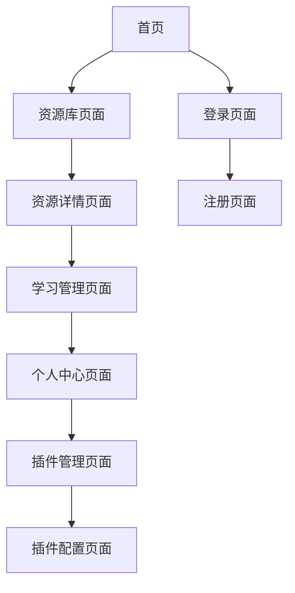

## 1. 产品概述

构建一个可扩展的韩语学习资源整合平台，采用模块化架构设计，支持视频播放、AI功能、博客日记等多种资源的"即插即用"式接入。

该平台旨在为韩语学习者提供一站式学习资源管理服务，通过清晰的分层架构和标准化接口，确保系统稳定性和可维护性，解决AI辅助编码时代码结构频繁被破坏的问题。

## 2. 核心功能

### 2.1 用户角色

| 角色    | 注册方式 | 核心权限                     |
| ----- | ---- | ------------------------ |
| 普通用户  | 邮箱注册 | 浏览学习资源、管理个人学习进度、使用基础学习工具 |
| 内容创作者 | 申请认证 | 发布学习资源、管理个人内容、查看学习数据统计   |
| 系统管理员 | 后台创建 | 用户管理、内容审核、系统配置、插件管理      |

### 2.2 功能模块

平台核心页面包括：

1. **首页**: 学习资源导航、热门推荐、用户登录入口
2. **资源库页面**: 资源分类浏览、搜索筛选、资源详情展示
3. **学习管理页面**: 学习进度跟踪、收藏管理、笔记记录
4. **个人中心页面**: 用户信息管理、学习统计、设置配置
5. **插件管理页面**: 插件安装配置、功能模块管理

### 2.3 页面详情

| 页面名称   | 模块名称  | 功能描述                  |
| ------ | ----- | --------------------- |
| 首页     | 导航栏   | 提供平台主要功能入口，包含用户登录状态显示 |
| 首页     | 资源推荐区 | 展示热门学习资源，支持按类型筛选      |
| 首页     | 快速开始  | 提供学习路径推荐和快速入口         |
| 资源库页面  | 分类导航  | 按资源类型（视频、文章、音频等）分类展示  |
| 资源库页面  | 搜索功能  | 支持关键词搜索、高级筛选          |
| 资源库页面  | 资源列表  | 展示资源缩略图、标题、简介等基本信息    |
| 资源库页面  | 资源详情  | 显示完整资源信息、相关推荐、用户评论    |
| 学习管理页面 | 进度跟踪  | 显示学习进度、完成状态、学习时长统计    |
| 学习管理页面 | 收藏夹   | 管理用户收藏的学习资源           |
| 学习管理页面 | 学习笔记  | 记录和管理学习笔记，支持标签分类      |
| 个人中心页面 | 用户信息  | 显示和编辑用户基本信息           |
| 个人中心页面 | 学习统计  | 展示学习数据图表和成就徽章         |
| 个人中心页面 | 系统设置  | 配置学习偏好、通知设置等          |
| 插件管理页面 | 插件市场  | 浏览和安装可用插件             |
| 插件管理页面 | 已安装插件 | 管理已安装插件的启用状态和配置       |

## 3. 核心流程

### 用户学习流程

用户通过首页导航进入资源库，浏览或搜索感兴趣的学习资源。选择资源后查看详情，可以开始学习并记录学习进度。学习过程中可以添加笔记和收藏。所有学习活动数据都会同步到个人中心进行统一管理。

### 插件扩展流程

系统管理员可以在插件管理页面安装新的功能模块。插件遵循标准化接口规范，安装后自动注册到相应功能区域。用户可以在个人设置中启用或禁用特定插件功能。

## 4. 用户界面设计

### 4.1 设计风格

* **主色调**: 深蓝色 (#1e40af) 作为主品牌色，浅灰色 (#f3f4f6) 作为背景色

* **按钮样式**: 圆角设计，主要操作为实心填充，次要操作为边框样式

* **字体选择**: 中文使用思源黑体，英文使用Inter，基础字号14px，标题逐级递增

* **布局风格**: 卡片式布局，顶部导航栏，侧边栏用于功能导航

* **图标风格**: 使用线性图标，保持简洁统一的视觉风格

### 4.2 页面设计概览

| 页面名称   | 模块名称  | UI元素                             |
| ------ | ----- | -------------------------------- |
| 首页     | 导航栏   | 顶部固定，包含logo、主要导航菜单、用户头像，背景为白色半透明 |
| 首页     | 资源推荐区 | 网格布局展示资源卡片，每行3-4个，卡片包含封面图、标题、简介  |
| 资源库页面  | 分类导航  | 左侧边栏树形结构，支持展开收起，当前选中项高亮显示        |
| 资源库页面  | 资源列表  | 响应式网格布局，支持列表和宫格两种视图切换            |
| 学习管理页面 | 进度跟踪  | 进度条、环形图表、时间轴等多种可视化形式             |
| 个人中心页面 | 用户信息  | 卡片式布局，头像圆形显示，信息分组展示              |

### 4.3 响应式设计

采用桌面端优先的设计策略，确保在1920x1080分辨率下最佳显示效果。同时适配平板（768px以上）和移动端（768px以下）设备，通过媒体查询实现布局的自适应调整。触摸设备优化包括增大点击区域、支持手势操作等。
