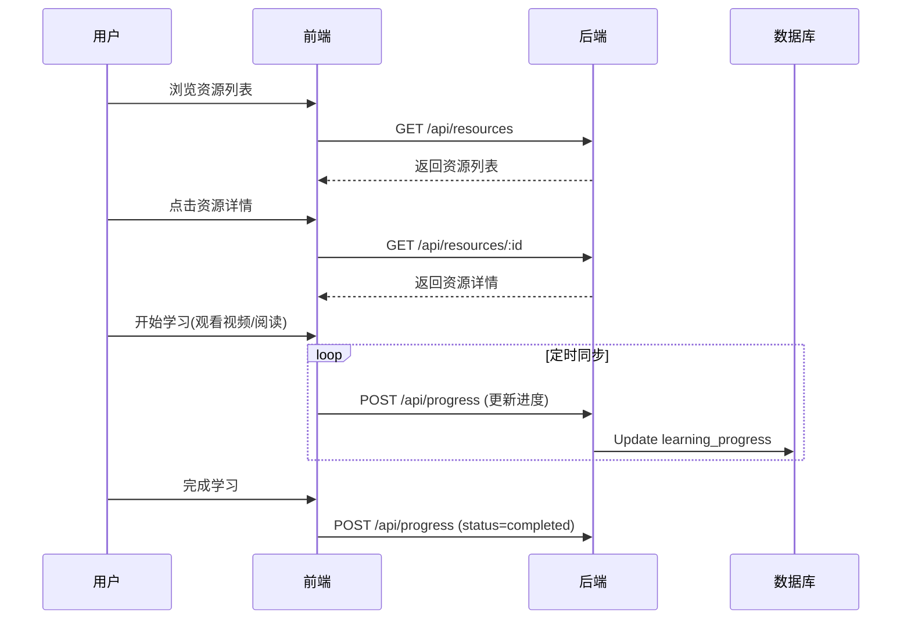

# 业务功能架构说明书

## 1. 业务模块划分

系统主要包含以下核心业务模块：

| 模块名称 | 标识 (Module ID) | 职责描述 | 关键实体 |
| :--- | :--- | :--- | :--- |
| **认证模块** | `auth` | 处理用户注册、登录、权限验证 | `users`, `auth.users` |
| **资源中心** | `resources` | 管理视频、文章等学习内容的发布与展示 | `resources` |
| **学习追踪** | `progress` | 记录用户的学习进度、完成情况 | `learning_progress` |
| **插件系统** | `plugins` | 提供系统扩展能力的管理与配置 | `plugins`, `user_plugins` |
| **系统设置** | `settings` | 管理全局系统配置（如 API Key） | `system_settings` |

## 2. 用户角色权限体系 (RBAC)

系统采用基于角色的访问控制 (RBAC) 模型。

### 2.1 角色定义

1.  **游客 (Guest)**
    - 权限：仅浏览公开的着陆页，无法查看详细学习资源。
2.  **注册用户 (User)**
    - 权限：
        - 查看所有免费学习资源。
        - 记录和查看个人学习进度。
        - 启用/禁用个人插件。
        - 修改个人资料 (头像、昵称)。
3.  **管理员 (Admin)**
    - 权限：
        - 包含所有用户权限。
        - **资源管理**: 创建、编辑、删除课程资源 (后端强制校验 Admin 角色)。
        - **用户管理**: 查看用户列表，封禁/解封用户。
        - **插件管理**: 发布新插件，管理系统级插件配置。
        - **系统设置**: 配置全局参数（如 DeepSeek API Key），生成邀请码，查看系统监控。

## 3. 核心业务流程

### 3.1 学习全流程

### 3.2 资源发布流程 (管理员)
1.  管理员登录系统 (获取 JWT Token)。
2.  进入“资源管理”后台页面。
3.  填写资源元数据（标题、类型、难度）。
4.  提交发布 -> 后端 `SupabaseGuard` 校验 Token -> 提取 User ID。
5.  后端服务使用 Token 创建 Supabase 客户端 -> 触发 DB RLS 策略 (Admin 权限) -> 写入 `resources` 表。

## 4. 功能清单

### 4.1 用户端
- [x] 邮箱注册/登录
- [x] 资源列表展示（支持筛选/搜索）
- [x] 资源详情页（Markdown渲染/视频播放器）
- [x] 学习进度自动保存
- [x] 多语言切换 (中/英/韩)
- [ ] 个人中心/仪表盘 (规划中)

### 4.2 管理端
- [x] 资源增删改查 (CRUD)
- [x] 邀请码生成与管理
- [x] 系统状态监控 (服务器/数据库)
- [x] 系统参数设置 (API Key)
- [ ] 用户管理列表 (规划中)
- [ ] 数据统计看板 (规划中)
