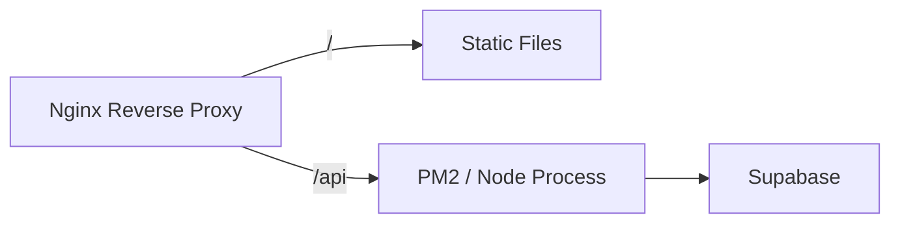

# 技术架构说明书

## 1. 系统架构概览

本系统采用现代化的前后端分离架构，基于 Monorepo 管理，旨在实现高性能、易扩展和低成本维护。

### 1.1 架构图

```mermaid
graph TD
    User[用户] --> |HTTPS/443| CDN[CDN / Edge Network]
    
    subgraph Frontend [前端应用 (Client)]
        CDN --> ReactApp[React SPA]
    end
    
    subgraph Backend [后端服务 (Serverless)]
        ReactApp --> |API Request| APIGateway[API Gateway]
        APIGateway --> NestApp[NestJS Serverless Function]
    end
    
    subgraph Database [数据存储 (Supabase)]
        NestApp --> |TCP/6543| PgBouncer[Connection Pooler]
        PgBouncer --> Postgres[PostgreSQL DB]
        ReactApp --> |Direct Auth| Auth[Supabase Auth]
        ReactApp --> |Assets| Storage[Supabase Storage]
    end

    NestApp --> |Log/Monitor| Monitor[CloudWatch / Netlify Logs]
```

## 2. 核心技术栈

### 2.1 前端 (apps/client)
- **核心框架**: React 18
- **构建工具**: Vite 6
- **语言**: TypeScript 5.x
- **样式方案**: TailwindCSS v3
- **状态管理**: Zustand (全局状态), React Query (服务端状态)
- **路由管理**: React Router 7
- **国际化**: i18next
- **图标库**: Lucide React

### 2.2 后端 (apps/server)
- **核心框架**: NestJS 10
- **运行时**: Node.js 18+
- **架构模式**: Modular Monolith (模块化单体), 适配 Serverless
- **Serverless 适配**: `@vendia/serverless-express`, `aws-lambda`
- **打包工具**: esbuild (优化冷启动体积)

### 2.3 数据与基础设施
- **数据库**: PostgreSQL 15+ (via Supabase)
- **身份认证**: Supabase Auth (JWT)
- **对象存储**: Supabase Storage
- **反向代理**: Nginx (VPS部署场景)

## 3. 服务依赖关系

| 服务组件 | 依赖项 | 说明 |
| :--- | :--- | :--- |
| **Client** | Backend API | 通过 REST API 获取业务数据 |
| **Client** | Supabase Auth | 直接与 Supabase 交互进行登录/注册 |
| **Server** | Supabase DB | 数据持久化存储 |
| **Server** | Supabase Auth Admin | 管理员操作用户账户 |

## 4. 部署拓扑图

### 4.1 Serverless 模式 (推荐)
适用于 Netlify/Vercel 部署，零运维成本。

```mermaid
graph LR
    ClientBuild[Client Build (/dist)] --> NetlifyCDN
    ServerBuild[Server Function (/dist/functions)] --> NetlifyFunctions
    NetlifyFunctions --> Supabase
```

### 4.2 传统 VPS/Docker 模式
适用于私有化部署。


